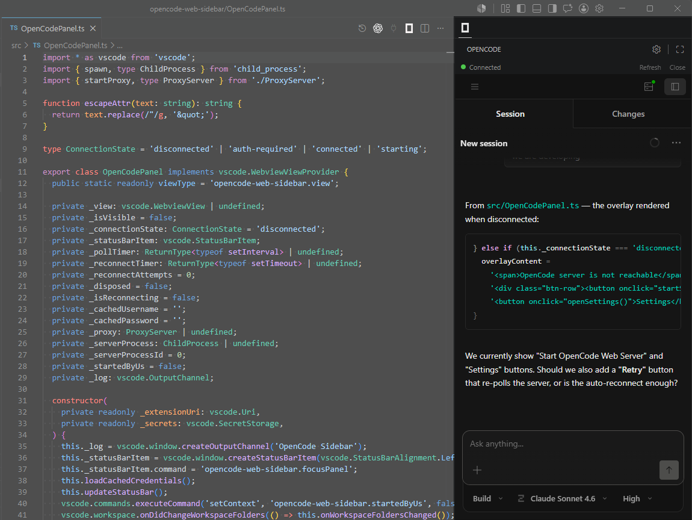

# OpenCode Sidebar GUI

Renders your [OpenCode](https://opencode.ai) web UI right inside VS Code's sidebar — connects to your server or starts a new one.

💫 Now automatically opens your working project folder in OpenCode Web when you open the sidebar!

## Features

- 🖥️ **Sidebar webview** — loads the OpenCode web UI in the secondary sidebar panel
- 🔔 **Status bar indicator** — shows connection state at a glance
- 🚀 **Start/Stop server** — click a button to run `opencode web` if the server is not running; stop it when done
- 🔃 **Auto-reconnect** — automatically retries when the server is unreachable (with Cancel button)
- 🎨 **Theme sync** — follows VS Code's light/dark mode automatically
- 🔑 **Password support** — credentials stored securely in your OS keychain via VS Code SecretStorage
- 🔐 **Env var fallback** — reads `OPENCODE_SERVER_PASSWORD` if no password is stored
- 📁 **Open files** — open files in VS Code directly from the webview
- 🌐 **Proxy** — local proxy strips frame-blocking headers for seamless iframe embedding

## ❗ Important: requirements

❌ This extension does not include or install `opencode` ➡️ You need to have `opencode` already installed and configured.

- If you want to start the `opencode web server` yourself this extension will connect to it automatically ➡️ Start the opencode web server in your preferred location (Local/LAN, Mac/Linux/Windows/WSL...), open the **OpenCode Sidebar** and it will connect to your server (you can customize the URL, user and password in the extension **Settings**).
- This extension can also start the web server for you on this machine ➡️ Click **Start OpenCode Web Server**. It will start it only once and other windows can reuse the same web server.

For more opencode web server config info see the official docs for [OpenCode Web](https://opencode.ai/docs/web/).

## Commands

All commands are available via the Command Palette (`Ctrl+Shift+P`).

| Command | Description |
|---------|-------------|
| `OpenCode: Toggle Panel` | Open or close the sidebar panel |
| `OpenCode: Focus Panel` | Bring the sidebar panel into focus |
| `OpenCode: Close Panel` | Close the sidebar panel |
| `OpenCode: Set Server Password` | Store username and password for password-protected servers |
| `OpenCode: Clear Server Password` | Remove stored credentials from the OS keychain |
| `OpenCode: Start OpenCode Web Server` | Start the web server process (hidden if server is already running) |
| `OpenCode: Stop OpenCode Web Server` | Stop the server process (only shown if the extension started it) |
| `OpenCode: Settings` | Open the extension's settings (also available as a gear icon in the panel title bar) |
| `OpenCode: Open File` | Open a file from the webview (used internally) |

## Settings

| Setting | Default | Description |
|---------|---------|-------------|
| `opencode-web-sidebar.url` | `http://localhost:4096` | URL of the OpenCode web UI to embed |
| `opencode-web-sidebar.hideButton` | `false` | Hide the OpenCode icon from the editor title bar |
| `opencode-web-sidebar.autoReconnect` | `true` | Automatically retry when the server is unreachable |
| `opencode-web-sidebar.maxReconnectAttempts` | `0` | Maximum reconnection attempts (0 = unlimited) |
| `opencode-web-sidebar.serverCommand` | `opencode web --port 4096` | Shell command to start the server (split by whitespace) |

## Panel controls

The panel has a **status bar** along the top:

- **Status dot** — green (connected), amber (starting / password required), red (disconnected / reconnecting)
- **Stop** — appears when the extension started the server; kills the process
- **Refresh** — reloads the iframe
- **Close** — closes the panel

The **panel title bar** (VS Code's built-in webview header) has a gear icon that opens the extension's settings.

### Connection states

| State | What you see |
|-------|-------------|
| Connected | Green dot, iframe loads your OpenCode UI |
| Password Required | Amber dot, lock icon + "Login" button in the panel |
| Disconnected | Red dot, "Start OpenCode Web Server" + "Settings" buttons |
| Starting... | Amber dot, spinner while the server process starts |
| Reconnecting... | Red dot, reconnection attempts with exponential backoff (1s → 2s → 4s → ... → 30s max); click **Cancel** to stop retrying |

### Authentication

If your OpenCode server is password-protected:

- Run **`OpenCode: Set Server Password`** from the Command Palette.
- Enter the username (defaults to `opencode`) and password.
- Credentials are stored in your OS keychain via VS Code SecretStorage.
- Alternatively, set the `OPENCODE_SERVER_PASSWORD` environment variable and the extension will pick it up automatically.

## Contributing

PRs are welcome! If you'd like to contribute, please open an issue first to discuss the change.

### Development

1. Clone the repo and run `npm install`.
2. Open the project in VS Code.
3. Press `F5` to launch a new Extension Development Host window.
4. Run `npm run compile` to rebuild after editing TypeScript files, or `npm run watch` for auto-recompilation.
5. Check the **OpenCode Sidebar** output channel (View → Output) for debug logs.
